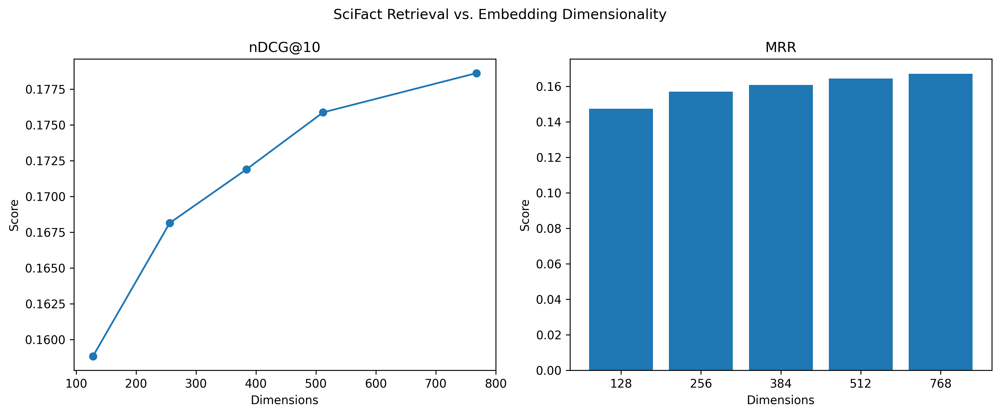

# Embedding Compression Benchmark for Information Retrieval

## Overview

This project investigates how reducing the dimensionality of sentence embeddings affects semantic retrieval performance.

Using the **BEIR SciFact** benchmark and **MPNet embeddings**, the project evaluates the trade-off between embedding size and retrieval quality by truncating 768-dimensional embeddings to lower dimensions (128, 256, 384, and 512).

The benchmark measures retrieval effectiveness using:

- **nDCG@10** (Normalized Discounted Cumulative Gain)
- **Recall@10**
- **Mean Reciprocal Rank (MRR)**

All retrieval and evaluation logic is implemented using **NumPy**, without relying on external information retrieval evaluation libraries.

---

## Objectives

- Evaluate the impact of embedding compression on retrieval quality.
- Measure retrieval effectiveness across multiple embedding dimensions.
- Analyze the trade-off between storage efficiency and search accuracy.
- Train a simple relevance classifier using retrieval-based features.

---

## Dataset

### BEIR SciFact

The benchmark uses the SciFact dataset from the BEIR benchmark suite.

**Dataset Characteristics**

- ~5,000 scientific documents
- ~1,100 queries
- Human-annotated relevance judgments

**Dataset Source**

https://public.ukp.informatik.tu-darmstadt.de/thakur/BEIR/datasets/scifact.zip

---

## Methodology

### 1. Data Preparation

The SciFact dataset is downloaded and parsed into:

- Document corpus
- Query set
- Relevance judgments (qrels)

The parsed data is cached as pickle files for faster reruns.

### 2. Embedding Generation

Documents and queries are encoded using:

```python
sentence-transformers/all-mpnet-base-v2
```

Original embedding size:

- 768 dimensions

Truncated versions are created by slicing the embeddings:

- 128 dimensions
- 256 dimensions
- 384 dimensions
- 512 dimensions
- 768 dimensions (baseline)

### 3. Retrieval

For each embedding dimension:

1. Normalize embeddings to unit vectors.
2. Compute cosine similarity using NumPy.
3. Retrieve Top-10 documents for each query.
4. Evaluate retrieval performance.

Cosine similarity:

```python
sim = query_embeddings @ document_embeddings.T
```

### 4. Evaluation Metrics

Implemented from scratch using NumPy.

#### nDCG@10

Measures ranking quality while rewarding highly ranked relevant documents.

#### Recall@10

Measures the proportion of relevant documents retrieved within the top 10 results.

#### MRR (Mean Reciprocal Rank)

Measures how early the first relevant document appears in the ranking.

### 5. Relevance Classification

A Logistic Regression classifier is trained using:

**Features**

- Cosine similarity
- Query length
- Document length

**Target**

- Relevant (1)
- Non-relevant (0)

**Libraries**

- scikit-learn
- pandas

---

## Results

| Dimension | nDCG@10 | Recall@10 | MRR |
|------------|----------|------------|----------|
| 128 | 0.1588 | 0.1919 | 0.1475 |
| 256 | 0.1682 | 0.2023 | 0.1571 |
| 384 | 0.1719 | 0.2050 | 0.1608 |
| 512 | 0.1759 | 0.2115 | 0.1644 |
| 768 | 0.1786 | 0.2137 | 0.1671 |

---

## Key Findings

- Retrieval quality consistently improves with higher embedding dimensions.
- Performance gains become smaller beyond 512 dimensions.
- 512-dimensional embeddings retain approximately **98%** of the retrieval effectiveness of full 768-dimensional embeddings.
- Significant embedding compression can be achieved with minimal retrieval degradation.
- Embedding truncation offers a practical storage-performance trade-off for large-scale retrieval systems.

### Main Conclusion

> 512-dimensional embeddings retained approximately **98% of the retrieval effectiveness** of full 768-dimensional embeddings while reducing embedding storage requirements by approximately **33%**.

---

## Visualization

Place the generated figure at:

```text
assets/truncationbench.png
```

Then GitHub will automatically render it:

```markdown

```


---

## Project Structure

```text
embedding-compression-benchmark/
│
├── assets/
│   └── truncationbench.png
│
├── data/
│   ├── corpus.pkl
│   ├── queries.pkl
│   └── qrels.pkl
│
├── embeddings/
│   ├── docs_128d.npy
│   ├── docs_256d.npy
│   ├── docs_384d.npy
│   ├── docs_512d.npy
│   ├── docs_768d.npy
│   ├── queries_128d.npy
│   ├── queries_256d.npy
│   ├── queries_384d.npy
│   ├── queries_512d.npy
│   └── queries_768d.npy
│
├── download.py
├── embed.py
├── evaluation.py
├── plot.py
│
├── results.json
├── requirements.txt
├── .gitignore
└── README.md
```

---

## Installation

```bash
pip install -r requirements.txt
```

---

## Execution

Run the benchmark in the following order:

```bash
python download.py
python embed.py
python evaluation.py
python plot.py
```

Generated outputs:

- Embeddings (`.npy`)
- Retrieval metrics (`results.json`)
- Visualization (`truncationbench.png`)

---

## Technologies Used

- Python
- NumPy
- Sentence Transformers
- scikit-learn
- pandas
- matplotlib
- tqdm

---

## Future Improvements

- Compare multiple embedding models (MPNet vs MiniLM)
- Add Recall@K for additional values of K
- Evaluate ANN indexing techniques
- Benchmark larger BEIR datasets
- Explore PCA-based dimensionality reduction

---

## License

This project is intended for educational and research purposes.